# uv-materialwidgets [](https://github.com/crucal-crucal/uv-materialwidgets.git) [](https://github.com/crucal-crucal/uv-materialwidgets.git)

[English](README.md) | [简体中文](docs/README.cn.md)

# download

[](https://github.com/crucal-crucal/uv-materialwidgets/releases/tag/v1.0.1)

| name                       | version |                 Complete state                  |                   need link libraries                    |
|:---------------------------|:-------:|:-----------------------------------------------:|:--------------------------------------------------------:|
| uvmaterialappbar           |  1.0.0  |  |             Qt5::Widgets & uvmaterialshared              |
| uvmaterialavatar           |  1.0.0  |  |             Qt5::Widgets & uvmaterialshared              |
| uvmaterialbadge            |  1.0.0  |  |             Qt5::Widgets & uvmaterialshared              |
| uvmaterialcheckbox         |  1.0.0  |  |             Qt5::Widgets & uvmaterialshared              |
| uvmaterialcircularprogress |  1.0.0  |  |             Qt5::Widgets & uvmaterialshared              |
| uvmaterialdialog           |  1.0.0  |  |             Qt5::Widgets & uvmaterialshared              |
| uvmaterialdrawer           |  1.0.0  |  |    Qt5::Widgets & uvmaterialshared & uvmaterialdialog    |
| uvmaterialfab              |  1.0.0  |  | Qt5::Widgets & uvmaterialshared & uvmaterialraisedbutton |
| uvmaterialflatbutton       |  1.0.0  |  |             Qt5::Widgets & uvmaterialshared              |
| uvmaterialiconbutton       |  1.0.0  |  |             Qt5::Widgets & uvmaterialshared              |
| uvmaterialprogress         |  1.0.0  |  |             Qt5::Widgets & uvmaterialshared              |
| uvmaterialradiobutton      |  1.0.0  |  |             Qt5::Widgets & uvmaterialshared              |
| uvmaterialscrollbar        |  1.0.0  |  |             Qt5::Widgets & uvmaterialshared              |
| uvmaterialslider           |  1.0.0  |  |             Qt5::Widgets & uvmaterialshared              |
| uvmaterialsnackbar         |  1.0.0  |  |             Qt5::Widgets & uvmaterialshared              |
| uvmaterialtabs             |  1.0.0  |  |  Qt5::Widgets & uvmaterialshared & uvmaterialflatbutton  |
| uvmaterialtextfield        |  1.0.0  |  |             Qt5::Widgets & uvmaterialshared              |
| uvmaterialtoggle           |  1.0.0  |  |             Qt5::Widgets & uvmaterialshared              |
| uvwaitingwidget            |  1.0.1  |  |                       Qt5::Widgets                       |
| uvswitchbtn                |  1.0.1  |  |                       Qt5::Widgets                       |
| uvtoggleswitch             |  1.0.1  |  |              Qt5::Widgets & uvawesomebutton              |
| uvmessagebar               |  1.0.1  |  |                       Qt5::Widgets                       |
| uvawesomebutton            |  1.0.1  |  |                       Qt5::Widgets                       |
| uvcombobox                 |  1.0.1  |  |                       Qt5::Widgets                       |
| uvstackwidget              |  1.0.1  |  |                       Qt5::Widgets                       |

|                           effect                            |              name              | version |
|:-----------------------------------------------------------:|:------------------------------:|:-------:|
|      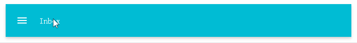      |        uvmaterialappbar        |  1.0.0  |
|      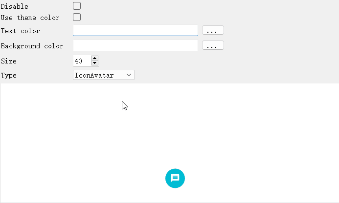      |        uvmaterialavatar        |  1.0.0  |
|      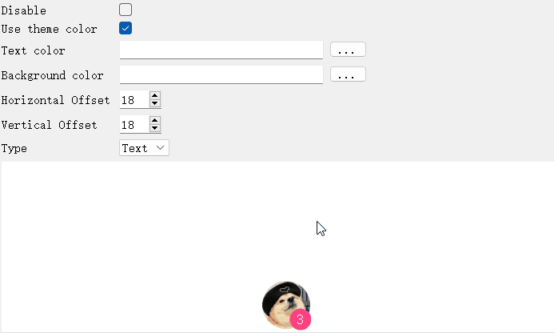       |        uvmaterialbadge         |  1.0.0  |
|     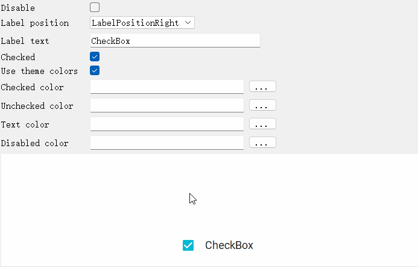     |       uvmaterialcheckbox       |  1.0.0  |
| 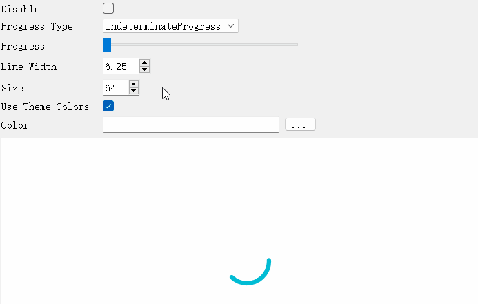 |   uvmaterialcircularprogress   |  1.0.0  |
|      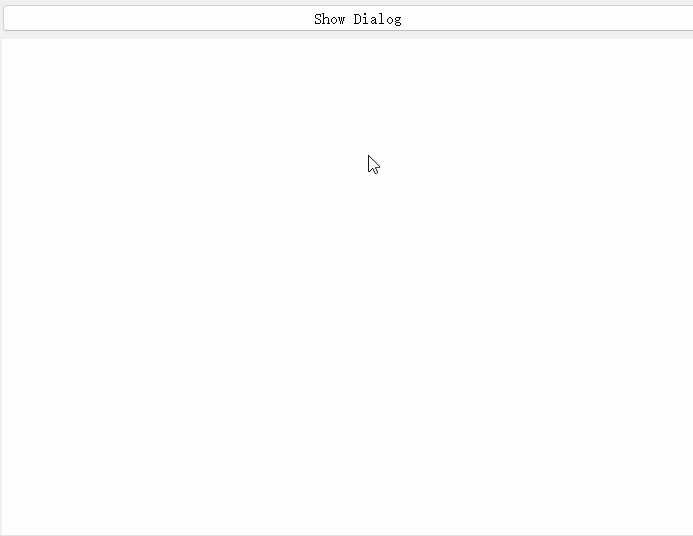      |        uvmaterialdialog        |  1.0.0  |
|      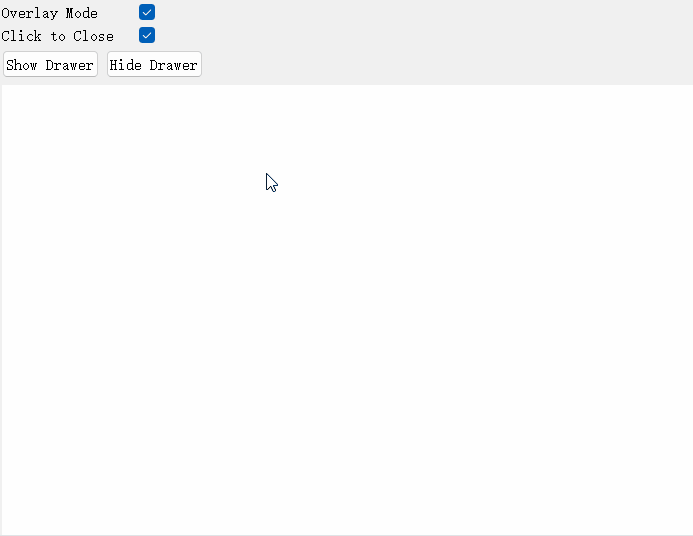      |        uvmaterialdrawer        |  1.0.0  |
|       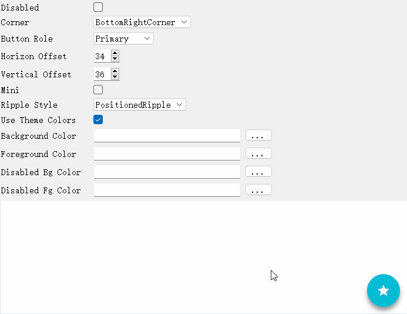        |         uvmaterialfab          |  1.0.0  |
|    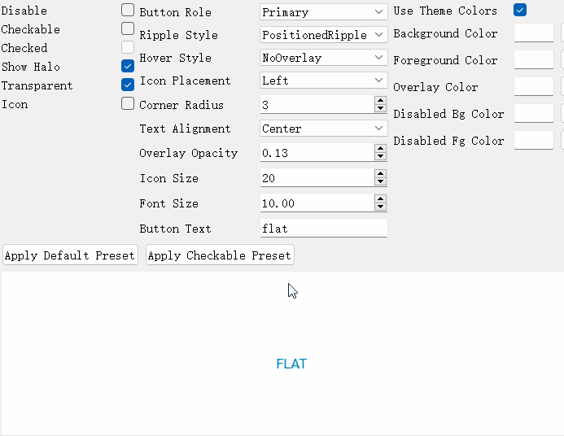    |      uvmaterialflatbutton      |  1.0.0  |
|    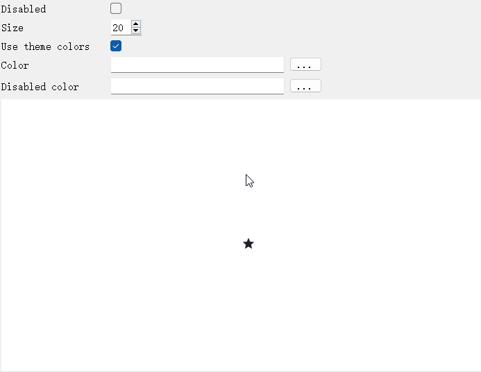    |      uvmaterialiconbutton      |  1.0.0  |
|     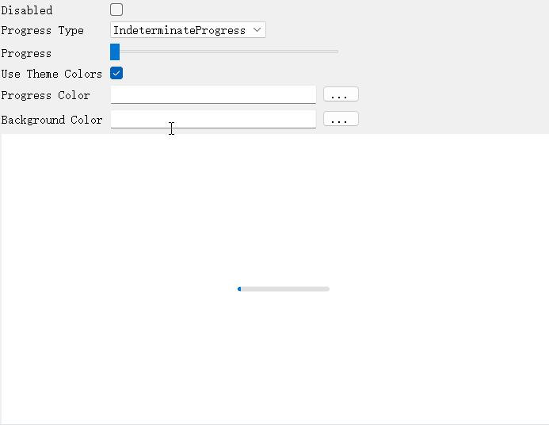     |       uvmaterialprogress       |  1.0.0  |
|   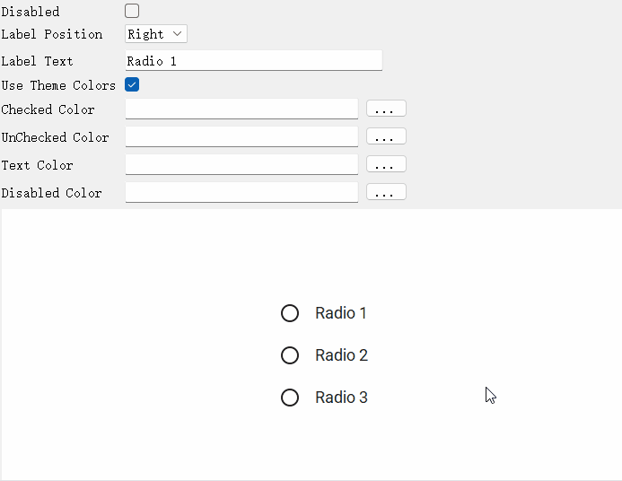    |     uvmaterialradiobutton      |  1.0.0  |
|    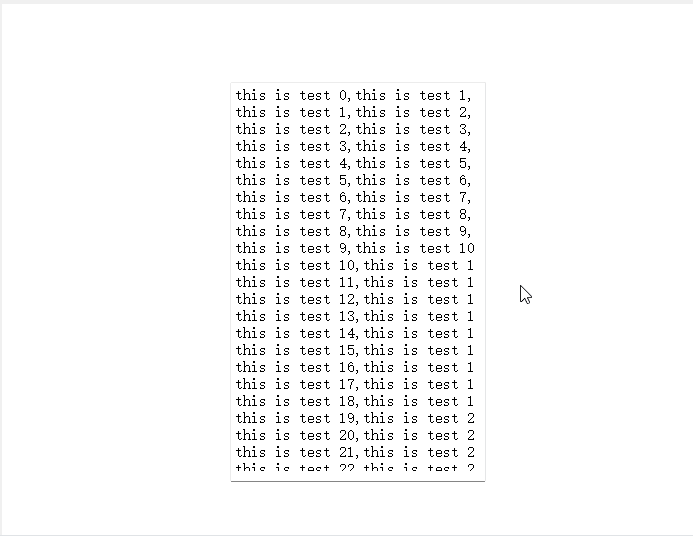     |      uvmaterialscrollbar       |  1.0.0  |
|      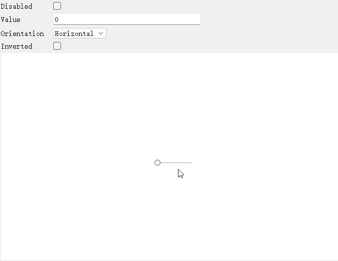      |        uvmaterialslider        |  1.0.0  |
|     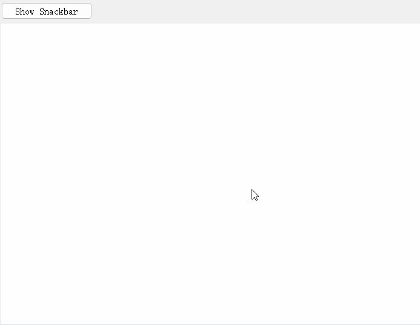     |       uvmaterialsnackbar       |  1.0.0  |
|       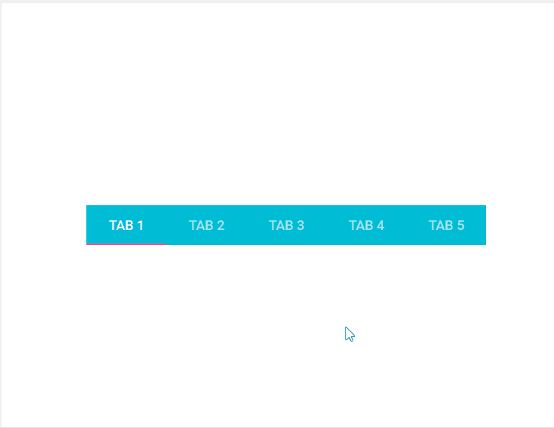       |         uvmaterialtabs         |  1.0.0  |
|         |      uvmaterialtextfield       |  1.0.0  |
|      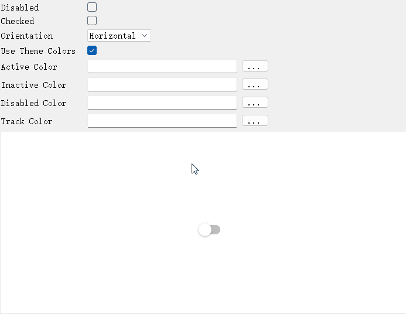      |        uvmaterialtoggle        |  1.0.0  |
|  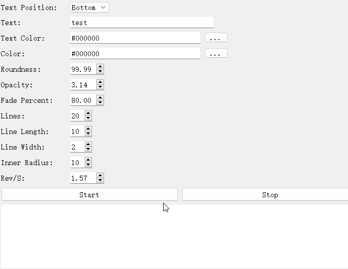   |        uvwaitingwidget         |  1.0.1  |
|    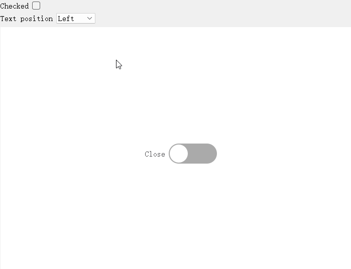     |          uvswitchbtn           |  1.0.1  |
|   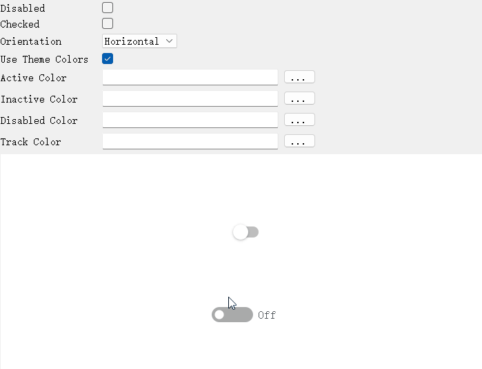   |         uvtoggleswitch         |  1.0.1  |
|    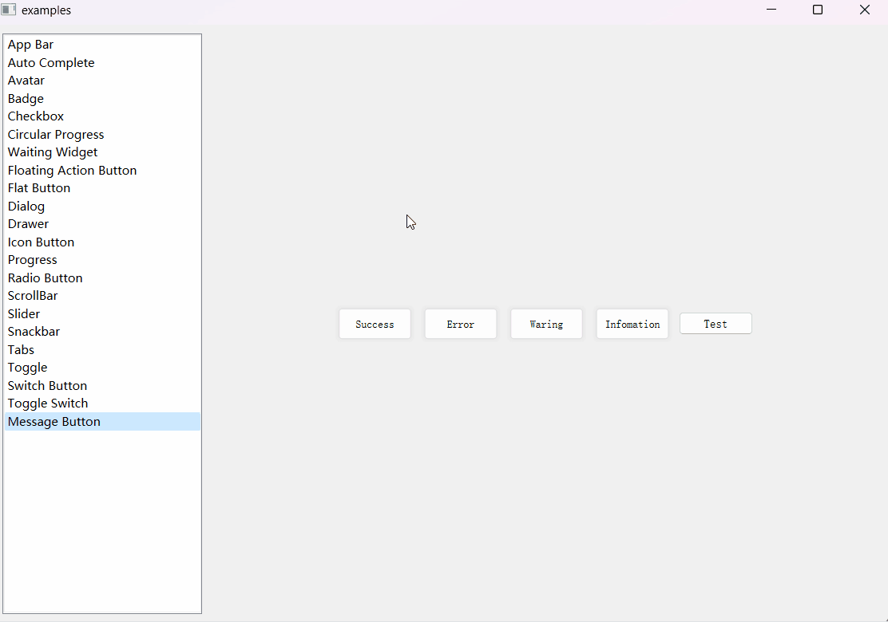    | uvmessagebar & uvawesomebutton |  1.0.1  |
|     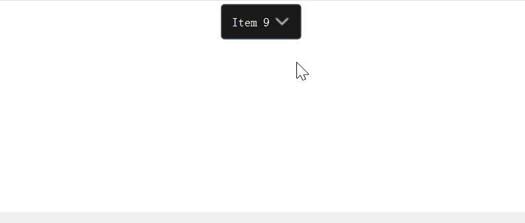     |           uvcombobox           |  1.0.1  |
|       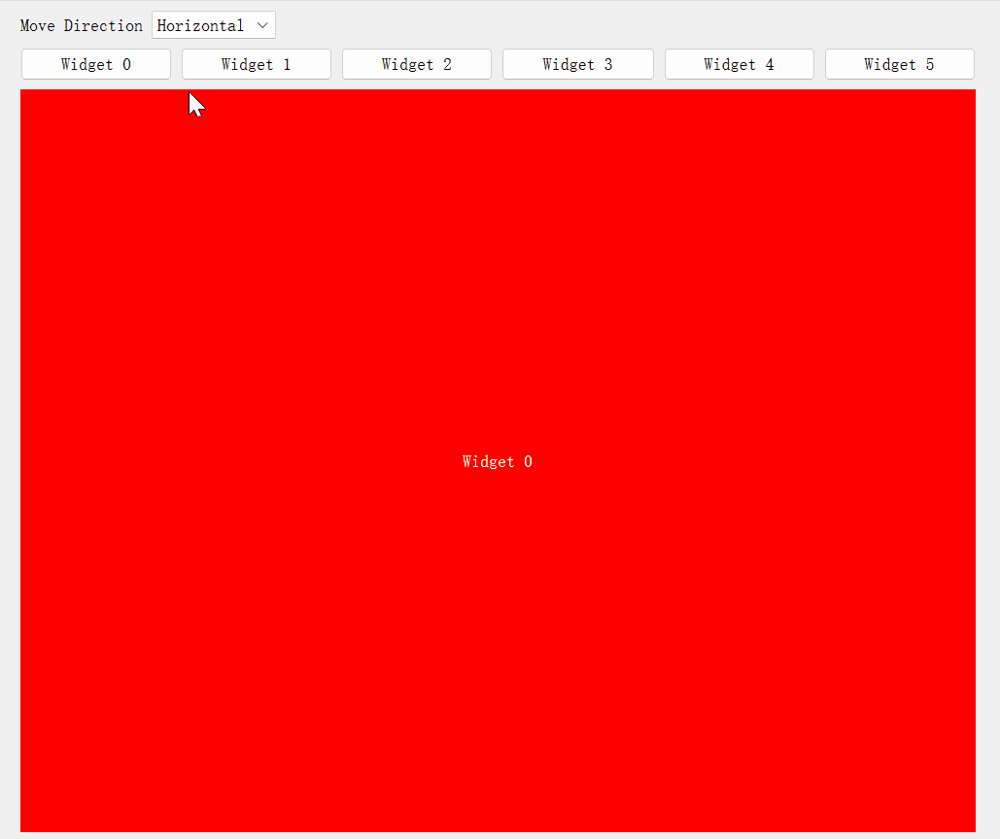        |         uvstackwidget          |  1.0.1  |


# Extraction instructions
All of the above components are exported dynamic libraries.

Libraries that start with the `uvmaterial` name require an additional link to the `uvmaterialshared library`, in addition to the required libraries written above.

<p style="font-size:16px;"><b>For example</b></p>

if you need to use the `uvmaterialtextfield library`,
you need to copy the `uvmaterialtextfield directory` and the `uvmaterialshared directory` to where you need to use them and write them in CMake.
```
include_directories(the path of your uvmaterialtextfield directory)
#your target or project
TODO
target_link_libraries(${TARGET_NAME} uvmaterialtextfield)
```
if you need to use the `uvtoggleswitch library`,
you need to copy the `uvtoggleswitch directory` to where you need to use them and write them in CMake.
```
include_directories(the path of your uvtoggleswitch directory)
#your target or project
TODO
target_link_libraries(${TARGET_NAME} uvtoggleswitch)
```

# build

<p style="font-size: 16px;">Windows</p>

build type (Debug, Release, RelWithDebInfo ...)\
**build environment**\
Qt Version: 5.15.2\
CMake Minimum version: 3.16\
Tool chain: Visual Studio 2022\
builder: MSVC 2019 | NMake Makefiles | Visual Studio 17 2022

<p style="font-size: 16px;">Linux (Ubuntu 22.04.3)</p>

build type (Debug, Release, RelWithDebInfo ...)\
**build environment**\
Qt Version: 5.15.2\
CMake Minimum version: 3.16\
builder: default\
Tool chain: default


# build example

[Windows](docs/build-win.md)

[Linux](docs/build-linux.md)