# uv-materialwidgets  

[English](../README.md) | [简体中文](README.cn.md)

| 名称                         |  版本   |                    完成状态                    |
|:---------------------------|:-----:|:------------------------------------------:|
| uvmaterialappbar           | 1.0.0 |  |
| uvmaterialavatar           | 1.0.0 |  |
| uvmaterialbadge            | 1.0.0 |  |
| uvmaterialcheckbox         | 1.0.0 |  |
| uvmaterialcircularprogress | 1.0.0 |  |
| uvmaterialdialog           | 1.0.0 |  |
| uvmaterialdrawer           | 1.0.0 |  |
| uvmaterialfab              | 1.0.0 |  |
| uvmaterialflatbutton       | 1.0.0 |  |
| uvmaterialiconbutton       | 1.0.0 |  |
| uvmaterialprogress         | 1.0.0 |  |
| uvmaterialradiobutton      | 1.0.0 |  |
| uvmaterialscrollbar        | 1.0.0 |  |
| uvmaterialslider           | 1.0.0 |  |
| uvmaterialsnackbar         | 1.0.0 |  |
| uvmaterialtabs             | 1.0.0 |  |
| uvmaterialtextfield        | 1.0.0 |  |
| uvmaterialtoggle           | 1.0.0 |  |
| uvmaterialwaitingwidget    | 1.0.0 |  |

|                           效果                           |             名称             |  版本   |
|:------------------------------------------------------:|:--------------------------:|:-----:|
|      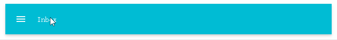      |      uvmaterialappbar      | 1.0.0 |
|      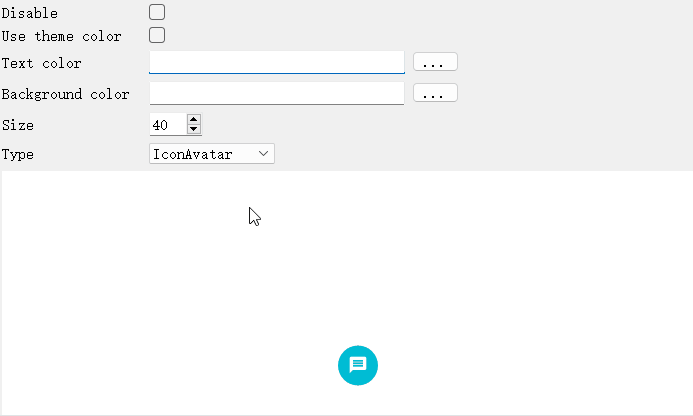      |      uvmaterialavatar      | 1.0.0 |
|      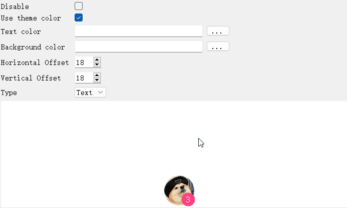       |      uvmaterialbadge       | 1.0.0 |
|     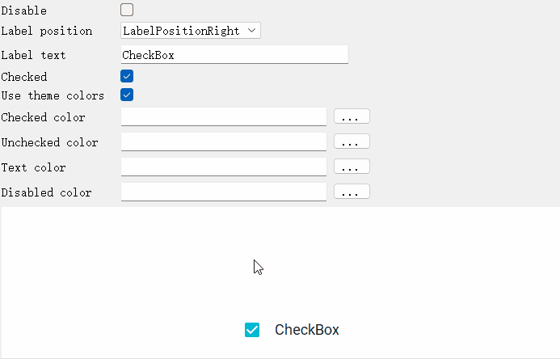     |     uvmaterialcheckbox     | 1.0.0 |
| 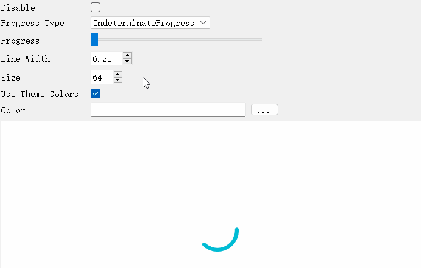 | uvmaterialcircularprogress | 1.0.0 |
|      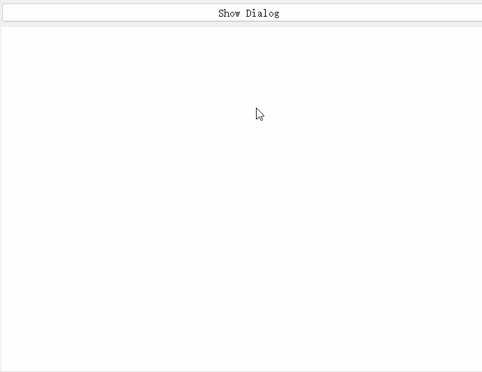      |      uvmaterialdialog      | 1.0.0 |
|      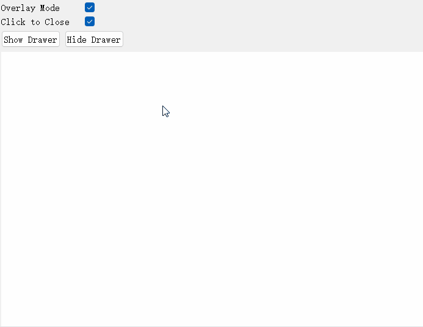      |      uvmaterialdrawer      | 1.0.0 |
|       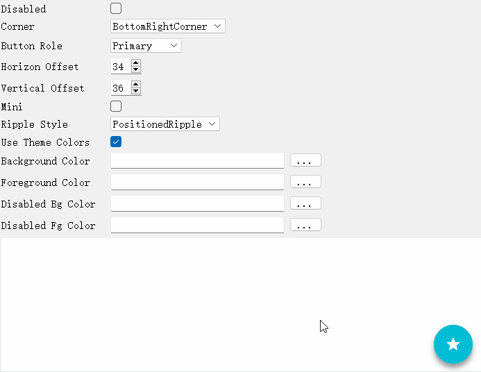        |       uvmaterialfab        | 1.0.0 |
|    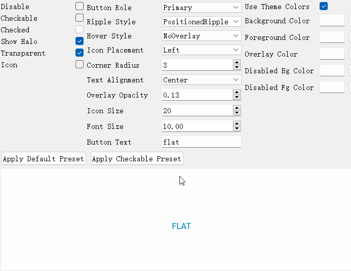    |    uvmaterialflatbutton    | 1.0.0 |
|    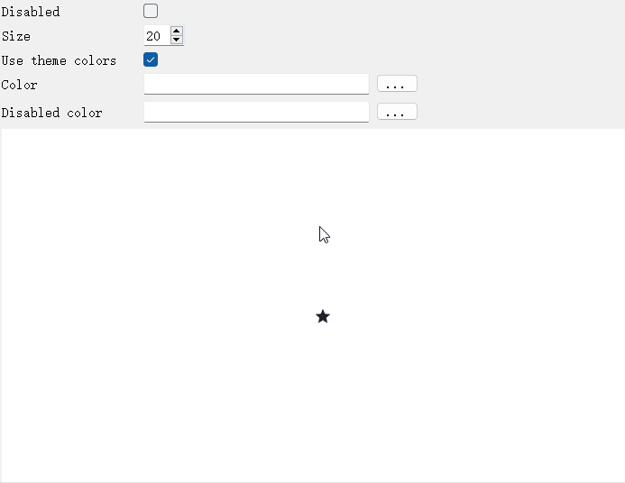    |    uvmaterialiconbutton    | 1.0.0 |
|     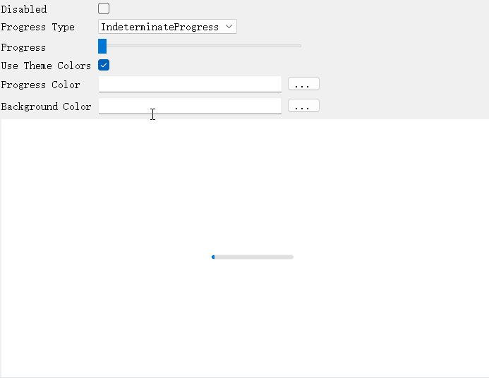     |     uvmaterialprogress     | 1.0.0 |
|   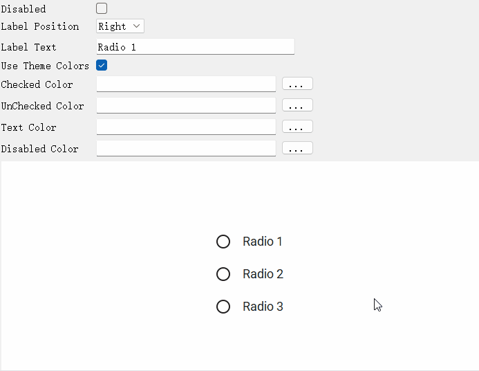    |   uvmaterialradiobutton    | 1.0.0 |
|    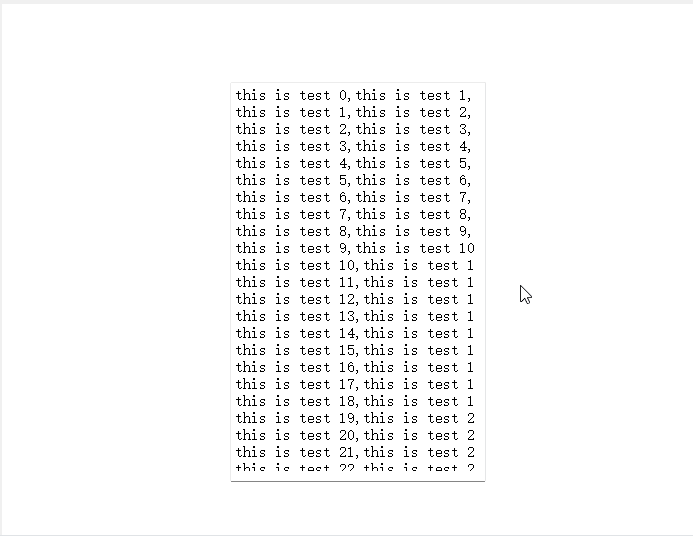     |    uvmaterialscrollbar     | 1.0.0 |
|      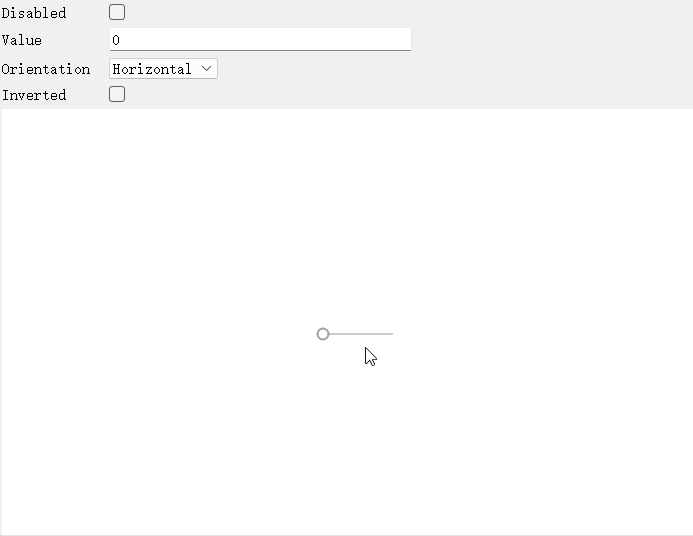      |      uvmaterialslider      | 1.0.0 |
|     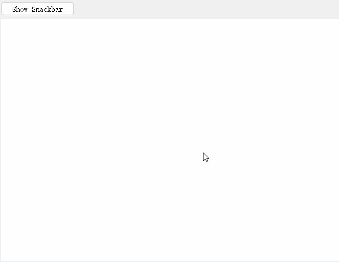     |     uvmaterialsnackbar     | 1.0.0 |
|       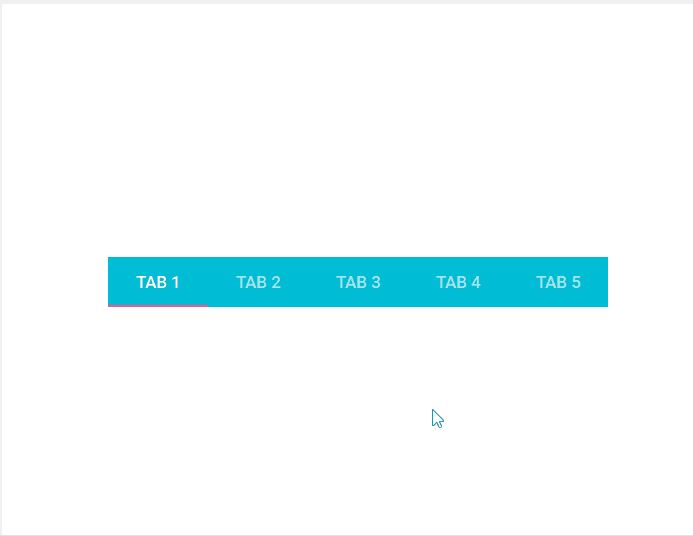       |       uvmaterialtabs       | 1.0.0 |
|         |    uvmaterialtextfield     | 1.0.0 |
|      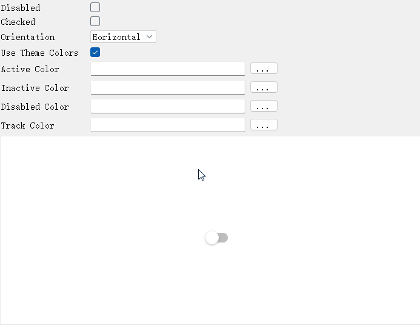      |      uvmaterialtoggle      | 1.0.0 |
|  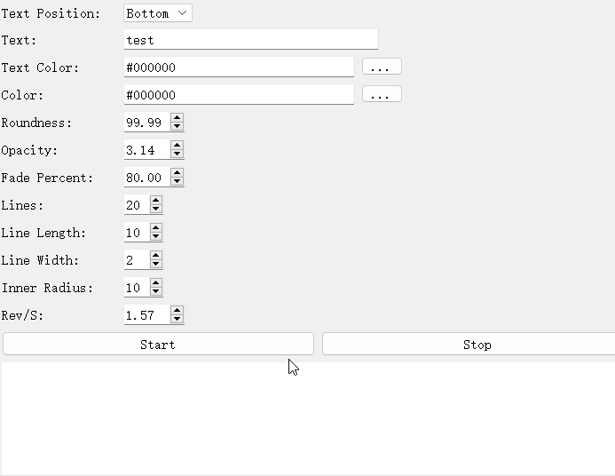   |  uvmaterialwaitingwidget   | 1.0.0 |