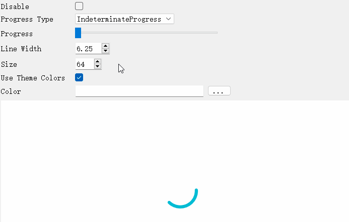
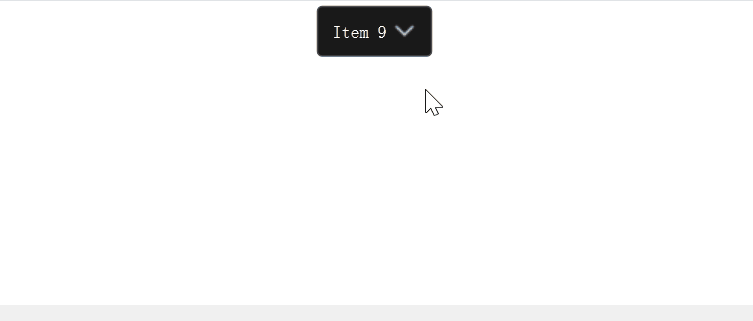

# uv-materialwidgets [](https://github.com/crucal-crucal/uv-materialwidgets.git) [](https://github.com/crucal-crucal/uv-materialwidgets.git)

[English](../README.md) | [简体中文](README.cn.md)

# 下载

[](https://github.com/crucal-crucal/uv-materialwidgets/releases/tag/v1.0.1)


| 名称                         |  版本   |                    完成状态                    |                          需要链接库                           |
|:---------------------------|:-----:|:------------------------------------------:|:--------------------------------------------------------:|
| uvmaterialappbar           | 1.0.0 |  |             Qt5::Widgets & uvmaterialshared              |
| uvmaterialavatar           | 1.0.0 |  |             Qt5::Widgets & uvmaterialshared              |
| uvmaterialbadge            | 1.0.0 |  |             Qt5::Widgets & uvmaterialshared              |
| uvmaterialcheckbox         | 1.0.0 |  |             Qt5::Widgets & uvmaterialshared              |
| uvmaterialcircularprogress | 1.0.0 |  |             Qt5::Widgets & uvmaterialshared              |
| uvmaterialdialog           | 1.0.0 |  |             Qt5::Widgets & uvmaterialshared              |
| uvmaterialdrawer           | 1.0.0 |  |    Qt5::Widgets & uvmaterialshared & uvmaterialdialog    |
| uvmaterialfab              | 1.0.0 |  | Qt5::Widgets & uvmaterialshared & uvmaterialraisedbutton |
| uvmaterialflatbutton       | 1.0.0 |  |             Qt5::Widgets & uvmaterialshared              |
| uvmaterialiconbutton       | 1.0.0 |  |             Qt5::Widgets & uvmaterialshared              |
| uvmaterialprogress         | 1.0.0 |  |             Qt5::Widgets & uvmaterialshared              |
| uvmaterialradiobutton      | 1.0.0 |  |             Qt5::Widgets & uvmaterialshared              |
| uvmaterialscrollbar        | 1.0.0 |  |             Qt5::Widgets & uvmaterialshared              |
| uvmaterialslider           | 1.0.0 |  |             Qt5::Widgets & uvmaterialshared              |
| uvmaterialsnackbar         | 1.0.0 |  |             Qt5::Widgets & uvmaterialshared              |
| uvmaterialtabs             | 1.0.0 |  |  Qt5::Widgets & uvmaterialshared & uvmaterialflatbutton  |
| uvmaterialtextfield        | 1.0.0 |  |             Qt5::Widgets & uvmaterialshared              |
| uvmaterialtoggle           | 1.0.0 |  |             Qt5::Widgets & uvmaterialshared              |
| uvwaitingwidget            | 1.0.1 |  |                       Qt5::Widgets                       |
| uvswitchbtn                | 1.0.1 |  |                       Qt5::Widgets                       |
| uvtoggleswitch             | 1.0.1 |  |              Qt5::Widgets & uvawesomebutton              |
| uvmessagebar               | 1.0.1 |  |                       Qt5::Widgets                       |
| uvawesomebutton            | 1.0.1 |  |                       Qt5::Widgets                       |
| uvcombobox                 | 1.0.1 |  |                       Qt5::Widgets                       |
| uvstackwidget              | 1.0.1 |  |                       Qt5::Widgets                       |


|                           效果                           |               名称               |  版本   |
|:------------------------------------------------------:|:------------------------------:|:-----:|
|            |        uvmaterialappbar        | 1.0.0 |
|            |        uvmaterialavatar        | 1.0.0 |
|             |        uvmaterialbadge         | 1.0.0 |
|          |       uvmaterialcheckbox       | 1.0.0 |
|  |   uvmaterialcircularprogress   | 1.0.0 |
|            |        uvmaterialdialog        | 1.0.0 |
|            |        uvmaterialdrawer        | 1.0.0 |
|               |         uvmaterialfab          | 1.0.0 |
|        |      uvmaterialflatbutton      | 1.0.0 |
|        |      uvmaterialiconbutton      | 1.0.0 |
|          |       uvmaterialprogress       | 1.0.0 |
|       |     uvmaterialradiobutton      | 1.0.0 |
|         |      uvmaterialscrollbar       | 1.0.0 |
|            |        uvmaterialslider        | 1.0.0 |
|          |       uvmaterialsnackbar       | 1.0.0 |
|              |         uvmaterialtabs         | 1.0.0 |
|         |      uvmaterialtextfield       | 1.0.0 |
|            |        uvmaterialtoggle        | 1.0.0 |
|     |        uvwaitingwidget         | 1.0.1 |
|         |          uvswitchbtn           | 1.0.1 |
|      |         uvtoggleswitch         | 1.0.1 |
|        | uvmessagebar & uvawesomebutton | 1.0.1 |
|          |           uvcombobox           | 1.0.1 |
|               |         uvstackwidget          | 1.0.1 |

# 提取须知
上述所有组件都是导出的动态库。

以`uvmaterial`开头的库除了上面所写的必需库之外，还需要一个额外的链接到`uvmaterialshared 库`。

<p style="font-size:16px;"><b>例子</b></p>

如果你需要使用 `uvmaterialtextfield 库`,
你需要复制 `uvmaterialtextfield 目录` 和 `uvmaterialshared 目录` 到你需要使用的地方, 并在CMake中写道:
```
include_directories(the path of your uvmaterialtextfield directory)
#your target or project
TODO
target_link_libraries(${TARGET_NAME} uvmaterialtextfield)
```
如果你需要使用 `uvtoggleswitch 库`,
你需要复制 `uvtoggleswitch 目录` 到你需要的地方, 并在CMake中写道:
```
include_directories(the path of your uvtoggleswitch directory)
#your target or project
TODO
target_link_libraries(${TARGET_NAME} uvtoggleswitch)
```

# 构建

<p style="font-size: 16px;">Windows</p>

build type (Debug, Release, RelWithDebInfo ...)\
**环境**\
Qt 版本: 5.15.2\
CMake 最小版本: 3.16\
工具链: Visual Studio 2022\
生成器: MSVC 2019 | NMake Makefiles | Visual Studio 17 2022

<p style="font-size: 16px;">Linux (Ubuntu 22.04.3)</p>

build type (Debug, Release, RelWithDebInfo ...)\
**环境**\
Qt 版本: 5.15.2\
CMake 最小版本: 3.16\
工具链: default\
生成器: default

# 构建示例
[Windows](build-win.md)

[Linux](build-linux.md)